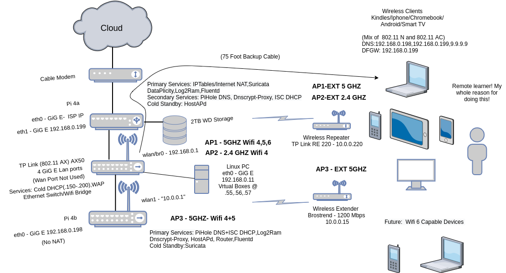
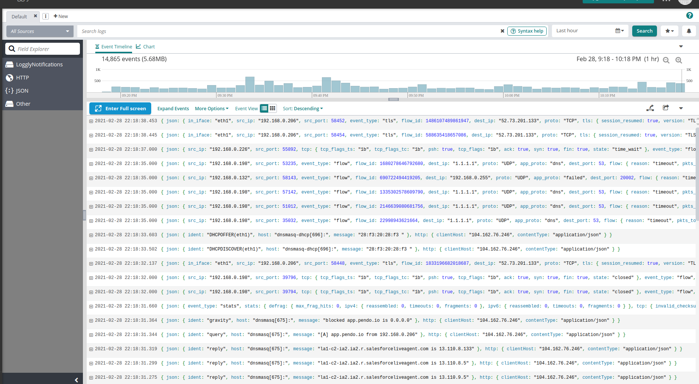
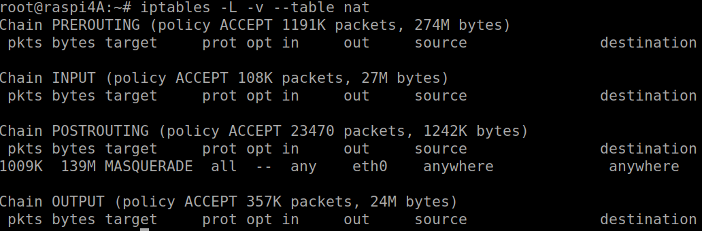
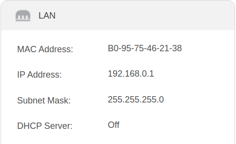
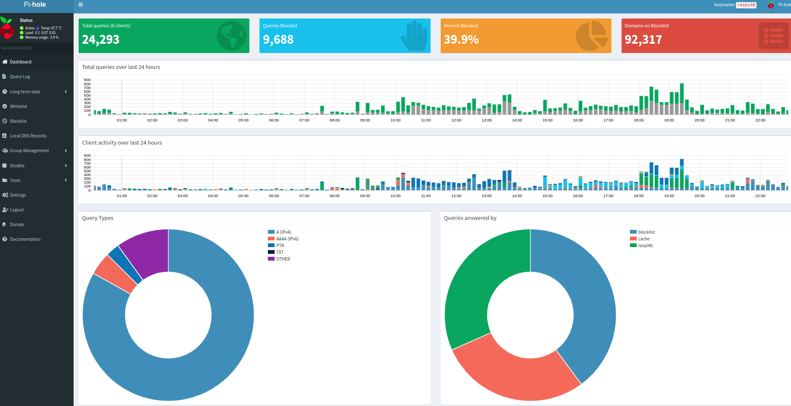
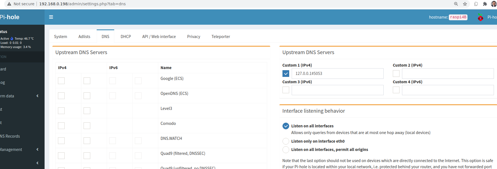
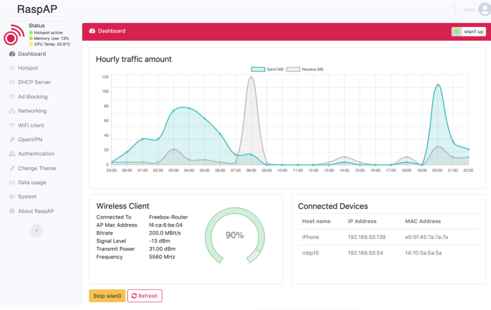

#### Cloud Wifi Visibility 

Recently I was looking to upgrade my security posture on my home Wi-Fi network. Historically it has been very difficult for me to gain full visibility on all of the devices traffic on my network. Using a [Linux ethernet bridge](https://github.com/jouellnyc/Cloud-Wifi-Visibility/tree/main/EthernetBridge) in front of the Wifi router I was able to see all the outgoing packets, but I wasn't able to identify precisely from which device it had come from easily - mainly because of the fact the wireless router device was doing NAT and the IDS/Linux Bridge only saw the external IP of the Router because it was seeing traffic after the NAT occurred. 

I heard good reviews about the [Tp-Link AX50](https://www.tp-link.com/us/home-networking/wifi-router/archer-ax50/), so I set that up. With a couple of tweaks -- I was able to see all of the traffic, send it to the cloud, and setup an IDS on all the traffic, having all the internal IPs on the LAN show up as their unique 192.168.0.X addresses -- so in case of compromise I know what box is the troublemaker. In addition, some other services were setup for redundancy and security but first let's focus on the overall visibility.

This can get really complicated/maybe impossible/slightly annoying based on what the wireless router manufacturer allows customer to do in terms of configuration -- and your budget.  This is a medium to low cost solution that worked to hit my requirements of full device visibility -- and some redundacy as you'll see. 

Here’s a picture of the final config:


Let's see how the traffic looks in Loggly:


Single IP singled out:


## What is the main key configuration that allows the visibility to happen?
If you refer to the final config diagram above, you can see that the WAN port of the Tp-Link AX50 is not used. We are completely bypassing the device's ability to use NAT (and all its fancy QoS and magic anti-virus features) and are simply using it's Wi-Fi capabilities and its ethernet switch capabilities.  Considering that the CPU of the device is significantly upgraded (dual core), it was worth it for me to do this. Also it is WiFi 6 capable so, has the future in mind. 

More details here: https://dongknows.com/tp-link-archer-ax50-review/

Note that the raspberry pi A is plugged into one of the AX50's LAN ports. Also keep in mind the default gateway for the wifi clients is no longer the wifi router now, it's rasberry pi A.

So now -- on raspberry pi A -- Suricata sees the traffic before it is NAT'ed -- it's listening on internal eth1 so the internal IPs are preserved:

```
root@raspi4A:~# grep -A 1 "af-packet" /etc/suricata/suricata.yaml
af-packet:
  - interface: eth1
```

Packets are NAT'ed and sent out on eth0:



Without all this setup internal clients would all be showing up as the external IP of the Wifi/Router as assigned by the ISP as described above. 

## A word on Service Redundancy.

As you can see in the diagram , I am using two Raspberry Pi's. That's not needed -- the reason I am doing this is for the sake of redundancy. If one pi were to go down I could fail Services over to the other or do a physical swap, depending on the damage. 

- For DNS, I'm taking the second Raspberry Pi (B) and making it the primary server, where the first Raspberry Pi (A) is primarily doing IP NAT and routing, but also listed as the second DNS server for the clients. DNS is easy to achieve redundancy -- IPtables is a physical swap :).

- For Wifi, I also am using hostapd on the second Raspberry Pi to offer a Wi-Fi SSID should the Wi-Fi capabilities of the AX50 fail. In my experience that is a certainty about ten thousand times more likely than the actual physical device or the ethernet components failing.  The performance of hostapd on the second pi is less than the AX50 but it's still very good and better than nothing for sure. 

Most Wi-Fi clients on Android or iOS fail very gracefully over to whatever pre setup wifi network is available --  I have set that up on each of the clients.
Each of the networks have extenders as there is a bit of an awkward shape to the location where these devices are --  there are closed doors at times as well. Humans tend to sit in front of couches and not the line of sight of the wifi...

- For DHCP, each of the raspberry pi's are running a copy of dnsmasq and providing DHCP services. Their log files are easily consumed by Fluentd, so can then be shipped to Loggly. Not the case for the AX50, which is no longer providing DHCP anymore:



Keep in mind despite how the picture may look, both of those pi's are actually on the same physical ethernet switch of the AX50 -- so they can provide DHCP services for either Wi-Fi network.

- Finally, Yes I really did purchase a 75 foot cable in case of a disaster / wifi outage -- however the cats are proving to be formidable physical attackers!


## A word on Pi hole and Speed.
I'm also striving for speed -- For another boost, Pi hole is doing a nice job by blocking almost 40% of DNS queries, which are for Ad Networks:


- https://pi-hole.net/

## A word on DNS and DNSmasq
I considered and tested various DoH,DoT configs -- this is large topic and technically and otherwise - it's being tested on my network. The setup in the picture is pi-hole forwarding DNS traffic to a locally running  dnscrypt-proxy on port 5053 and then sending that out. Some common options of compatible servers are Cloudflare, Quad9, or Google. YMMV.

More Details: 
- https://dnscrypt.info/faq/
- https://docs.pi-hole.net/ftldns/dns-resolver/
- https://thekelleys.org.uk/dnsmasq/docs/dnsmasq-man.html
- https://www.cloudflare.com/learning/dns/dns-over-tls/ 



NOTE: Pihole runs a modified version of dnsmasq, but dnsmasq configs on the Pi can basically be treated as native.


## A word on Hostapd.
My strongest recommendation here is not to configure hostapd at all --  it was a extreme pain to match up the capabilities of that with the hardware that I purchased and  figure out what channels are actually supported on the device. Lots of time in forums and emailing vendors. 

If you'd like to pursue that anyway I would suggest:

- Doing a lot of the research up front before you make a purchase. I used a BrosTrend 1200Mbps Linux USB WiFi Adapter -- https://www.amazon.com/gp/product/B07FCN6WGX/ref=ppx_yo_dt_b_search_asin_title?ie=UTF8&psc=1 

- Use Raspap -- https://github.com/RaspAP/raspap-webgui



## A word on Fluentd.
- Use it. :) -- it's current and easy to use. --  https://www.fluentd.org/
- rsyslogd was not very easy in the end to use -- an open TLS bug made me sour on it.


## A word on Suricata.
- Multi threaded IDS -- runs on pi's --  https://suricata-ids.org/
- You can choose another IDS but it's easy to install 
- Make sure to use https://github.com/OISF/suricata-update to ease admin of the rulesets if you do


## Additional thoughts for the future

Raspberry Pi A is a single point of failure.  The cable modem has more than one ethernet port so it might be possible to set up both raspberry pi’s and share some sort of cluster IP -- or do a basic automated failover from one to the other.

 Also the cable modem is definitely a single point of failure -- purchasing another link from an ISP and then have the Raspberry Pi's dual path to both of the respective cable modems would be much better. For that matter one could possibly tether from a cell phone.

Finally, an ansible script would make DR a breeze...


## Requirements
Cloud Logger (like Loggly or Logio, etc)  and at least one Rasberry Pi
