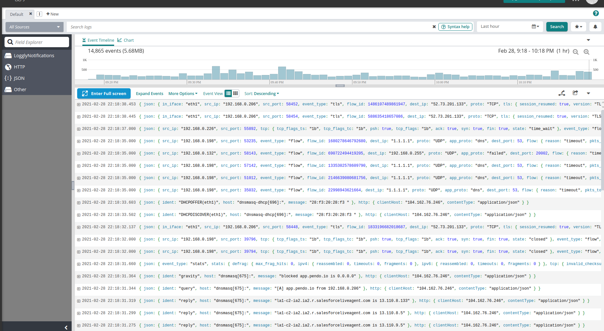
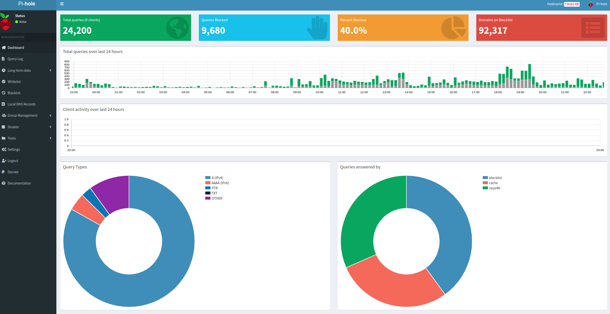

#### Cloud Wifi Visibility 

Recently I was looking to upgrade my security posture on my home Wi-Fi network. Historically it has been very difficult for me to gain full visibility on all of the devices traffic on my network. Using a Linux ethernet bridge in front of the Wifi router  I was able to see all the outgoing packets, but I wasn't able to identify precisely from which device it had come from easily - mainly because of the fact the wireless router device was doing NAT and the IDS/Linux Bridgle only saw the external IP of the Router. 

This can get really complicated/maybe impossible based on what the manufacturer allows customer to do in terms of configuration -- and there could be many waysto achieve it. This is a medium tolow cost solution that worked to hit my requirements of full device visibilty.

In this case I am using Tp-Link AX50. With a couple of tweaks -- I was able to see all of the traffic, send it to the cloud, and setup an IDS on all the traffic. In addition some other service were setup for redundancy and security but first let's focus on the overall visibility.

Here’s a picture of the final config:

Let's see how it looks in Loggly:

What's important to keep in mind here is that you can see that there are various internal Source IP addresses -- they are all different --  those represent different devices on my local lan.  Without this setup they would all be the external IP of the Wifi/Router as assigned by the ISP -- because that's what Surciata 'sees'.  Now -- on rasberry pi A -- Suricata sees the traffic before it is NAT'ed -- so the internal IPs are preserved. Fluentd then sends to Loggly.

## What is the main key configuration that allows the visibility to happen?
If you refer to the diagram you can see that the WAN port of the Tp-Link AX50 is not used. We are completely bypassing the device's ability to use NAT (and all its fancy QoS and magic anti-virus features) and simply using it's Wi-Fi capabilities and its ethernet switch capabilities. 

Considering that CPU of the device is significantly upgraded (dual core), it was worth it for me to do this. Also it is WiFi 6 capable so, has the future in mind. More Details here: https://dongknows.com/tp-link-archer-ax50-review/

## A word on Pi hole and Redundancy.
As you can see in the diagram , I am using two Raspberry Pi's. That's not needed -- the reason I am doing this is for the sake of redundancy. If one pi were to go down I could fail Services over to the other or do a physical swap, depending on the damage. 

That being the case I'm also striving for additional speed here -- I'm taking the second Raspberry Pi (B) and making it the primary DNS recursive resolver, where the first Raspberry Pi (A) is primarily doing IP NAT and routing, but also listed as the second DNS resolver for the clients. DNS is easy to achieve redundancy, IPtables is a physical swap :).

I also am using hostapd on the second Raspberry Pi to offer a Wi-Fi SID/ESS should the Wi-Fi capabilities of the AX50 fail. In my experience that is a certainty about ten thousand times more likely than the actual physical device or the ethernet components failing.  The performance of hostapd on the second pi is less than the AX50 but it's still very good and better than nothing for sure. 

Most Wi-Fi clients on Android or iOS fell very gracefully over to whatever pre setup wif network is still available --  I have set that up on each of the clients.

Finally each of the networks have extenders as there is a bit of an awkward shape to the location where these devices are --  there are closed doors at times as well. Humans tend to sit in front of couches and not the line of sight of the wifi...

Pi hole is doing a nice job in speeding up my network by blocking a lot of Ad Networks:

## A word on DNS and DNSmasq

## A word on Hostapd.
My strongest recommendation here is not to configure hostapd at all --  it was a extreme pain to match up the capabilities of that with the hardware that I purchased and  figure out what channels are actually supported on the device. Lots of time in forums... If you'd like to pursue that anyway I would suggest doing a lot of the research up front before you make a purchase. I used a BrosTrend 1200Mbps Linux USB WiFi Adapter -- https://www.amazon.com/gp/product/B07FCN6WGX/ref=ppx_yo_dt_b_search_asin_title?ie=UTF8&psc=1 

## Requirements
Cloud Logger and Rasberry Pi
