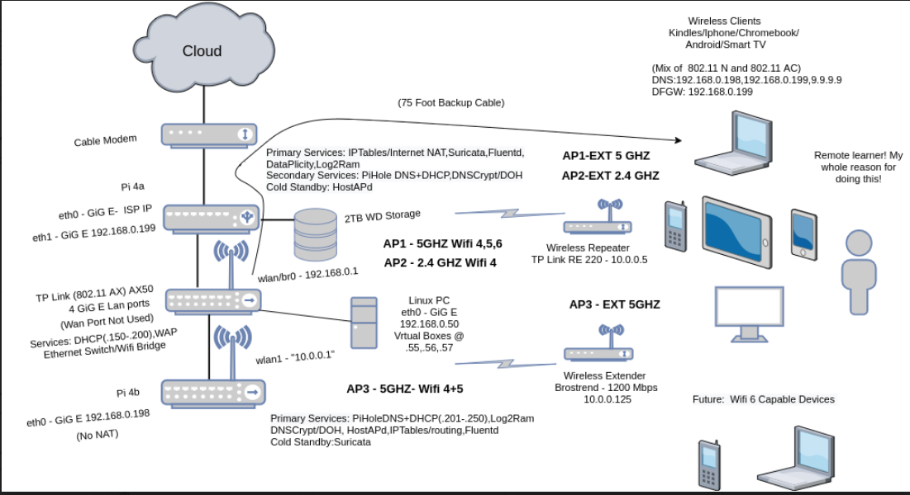

#### Cloud Wifi Visibility 

Recently I was looking to upgrade my security posture on my home Wi-Fi network. Historically it has been very difficult for me to gain full visibility on all of the devices traffic on my network. Using a Linux ethernet bridge in front of the Wifi router  I was able to see all the outgoing packets, but I wasn't able to identify precisely from which device it had come from easily - mainly because of the fact the wireless router device was doing NAT.

So with a couple of tweaks --  I was able to see all of the traffic, send it to the cloud, and setup an IDS on all the traffic. In addition some other service were setup but for now the main piece is focusing on the overall visibility.

First here’s a picture of my final config:

## What is the main key configuration that allows the visiblity to happen?
If you refer to the diagram you can see that the wan port of the Tp-Link AX50 is not used. We are completely bypassing the device's ability touse Nat (and all its fancy QoS and magically anti-virus features) and simply using it's Wi-Fi capabilities and its ethernet switch capabilities. Considering that CPU of the device is significantly upgraded (dual core), it was worth it for me to do this. Also it is WiFi six capable sohas the future in mind. More Details here: https://dongknows.com/tp-link-archer-ax50-review/

## Requirements
Cloud Logger and Rasberry Pi
